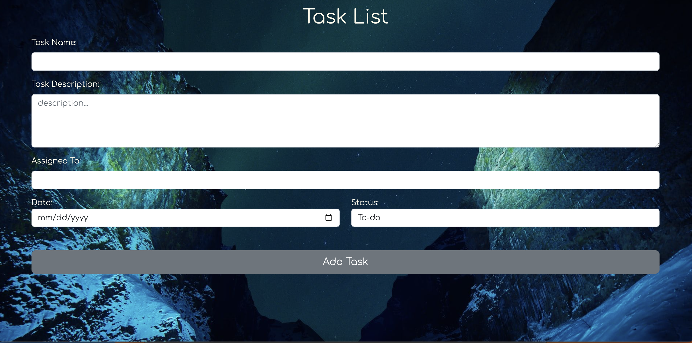
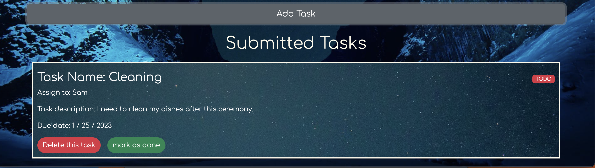

<!-- header  -->
<h1 style="text-align: center;">Gen_todoList</h1>

<!-- Description  -->
This application we created will help you organize your daily task. Not only will it help you on a day to day basis, but you will be able to keep track of those very important things that you will need to do each day.  The great thing about it is when you complete a task you can mark it as down and then it will be deleted so you won't be confused if you finished it or not.  Try out this application and you will be very satisfied with how it will help you.
 

<!-- Deployment link  -->
<h2 style="text-align: center; text-decoration: underline">Deployment link:</h2>

***
[LIVE APP](https://incandescent-macaron-a5ca25.netlify.app/)
***
 

<!-- Images  -->

 

<!-- Technologies used  -->
<h2 style="text-align: center;">Technologies used</h2>

- HTML5
- CSS
- Bootstrap
- JavaScript